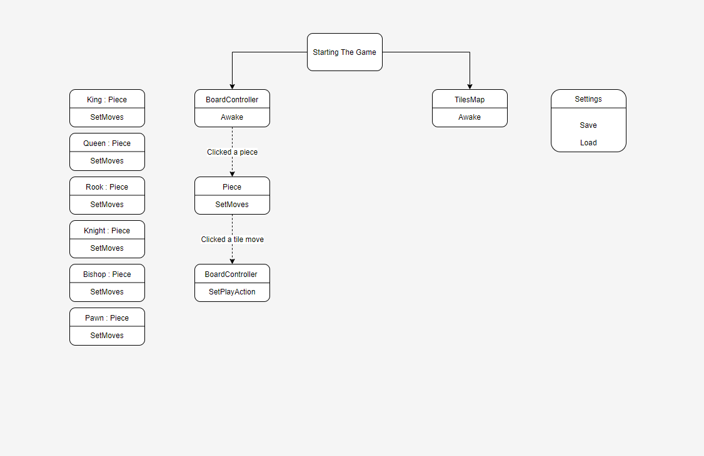
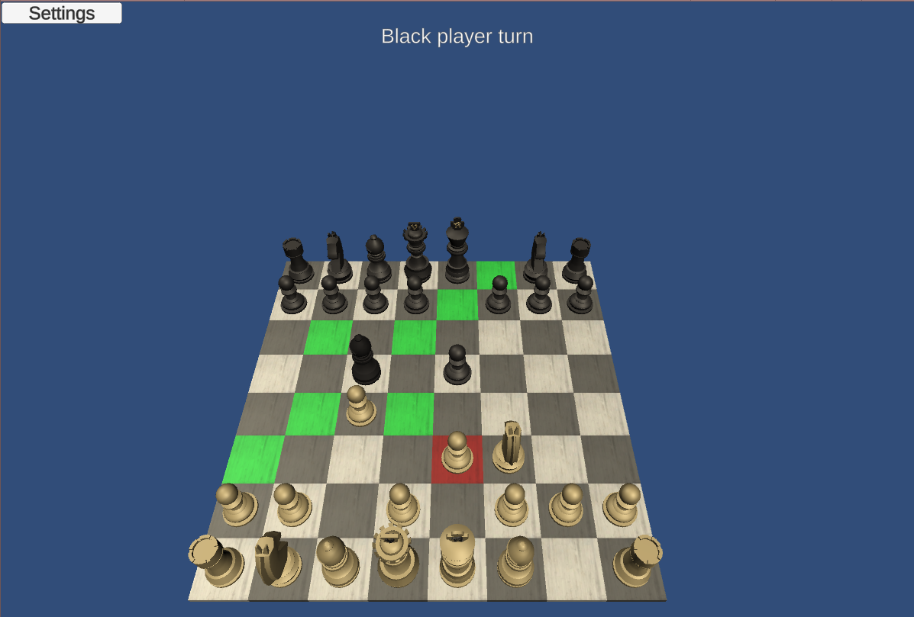
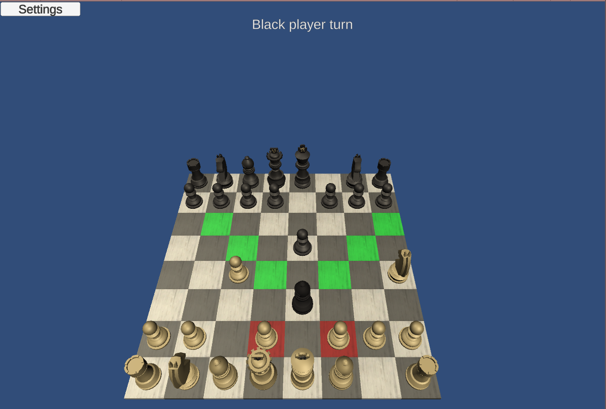
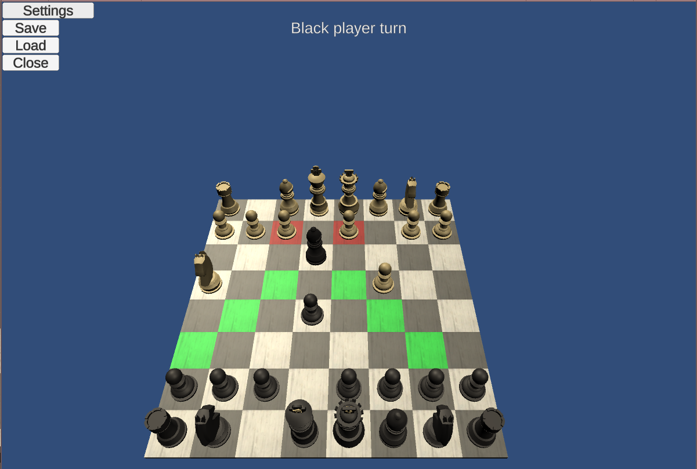

# Chess

Created the Chess board game in Unity 2019.3.15f1.

This is a great game to create as a stepping stone to improve your capabilities as a game developer.
The rules are widely known, the game has enough logic to enable different implementations and the use of different tools.

Game development is my passion and I created this game for fun and personal growth.
I'm a developer and worked on this game independently. The graphical aspects of the game are imported and not the current focus of this project.

To run the project, download/clone and run from unity.

<a href="https://meirshomron.github.io/MakingOfChess.html">Making Of Chess Article</a>

## Game Flow

## Future Possible Upgrades
- [ ] Chess AI.
- [ ] Multiplayer.
- [ ] Sounds.
- [ ] Start game screen.
- [ ] Animation of piece movement.
- [ ] Explosion animation when a piece is hit.
- [ ] Turn countdown time limit.
- [ ] Create a mobile version - currently it's written for PC.
- [x] Pawn promotion rule.
- [ ] Castling rule.
- [ ] En Passant rule.

##  Images:

