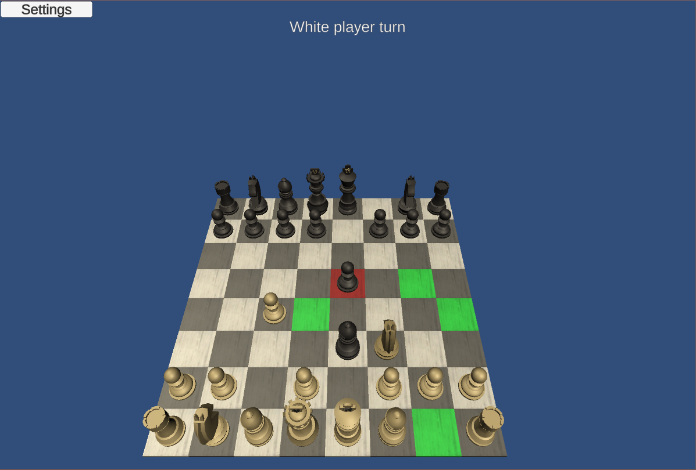

# Chess

Created the Chess board game in Unity 2019.3.15f1.

This is a great game to create, using it as a steppingstone to improve your game developer capabilities.
Its rules are widely known. Furthermore, the game has enough logic to enable different implementation and the use of various tools.

Game development is my passion and I created this game for fun and personal growth.
I'm a developer and worked on this game independently. The graphical aspects of the game are imported and not the current focus of this project.

To run the project, download/clone and run from Unity.

<a href="https://meirshomron.github.io/MakingOfChess.html">Making Of Chess Article</a>

## Game Flow

## Future Possible Upgrades
- [ ] Chess AI.
- [ ] Multiplayer.
- [ ] Sounds.
- [ ] Start game screen.
- [ ] Animation of piece movement.
- [ ] Explosion animation when a piece is hit.
- [ ] Turn countdown time limit.
- [ ] Create a mobile version - currently it's written for PC.
- [x] Pawn promotion rule.
- [ ] Castling rule.
- [ ] En Passant rule.

##  Images:

